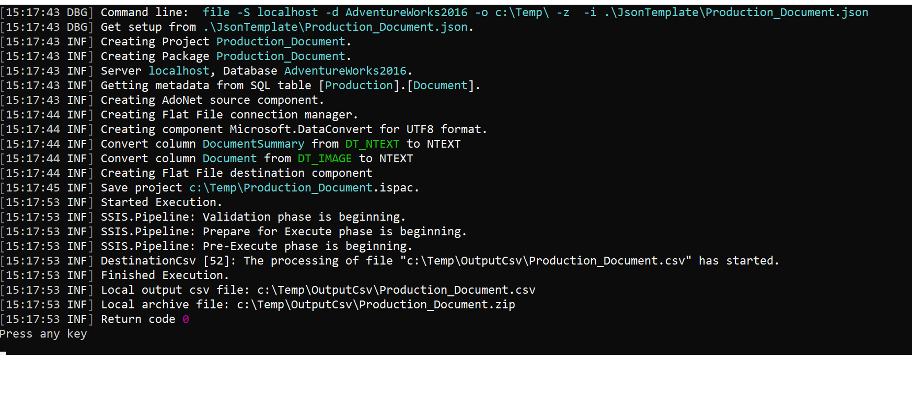

# Dynamic Huge Csv Generation. dhcg.exe
This utility is made for dynamic generation of SSIS packages which unload huge csv files from tables or user SQL queries.

Utility supports two Development Environments: 
- .NET4.5 Microsoft SQL Server 2014 SP3  
- .NET4.7 Microsoft SQL Server 2019  

Recommended debugging and testing tools:
- Visual studio community 2019 
- Business intelligence for visual studio 2013: https://www.microsoft.com/en-us/download/details.aspx?id=42313
 
For sample database:
https://docs.microsoft.com/en-us/sql/samples/adventureworks-install-configure?view=sql-server-ver16&tabs=ssms

**Setup project environment**

1. Create Temp folder with subfolders: InputJson, OutputCsv, Log, InputQueryJson, OutputQueryCsv
2. Set log path in App.config serilog:write-to:File.path" value="{TempPatch}\Log\DynamicCsvGeneration.txt"
3. Copy gzip.exe to Temp folder
4. Copy ./JsonTemplate/trigger_template.json to Temp folder


The dynamic generator can be called from another package in which json requests are orchestrated. 
To do this, you need to configure Integration Services service:
1. Grant access to the Integration Services service for 2 accounts:  
- NT Service\SQLSERVERAGENT 
- your Windows Service accounts.

Windows service accounts: https://www.mssqltips.com/sqlservertip/6236/connecting-to-integration-services-access-is-denied-in-sql-server-2016-or-2017/

To grant access to the Integration Services service
1. Run Dcomcnfg.exe. Dcomcnfg.exe provides a user interface for modifying certain settings in the registry.
2. In the Component Services dialog, expand the Component Services > Computers > My Computer > DCOM Config node.
3. Right-click Microsoft SQL Server Integration Services 12.0, and then click Properties.
4. On the Security tab, click Edit in the Launch and Activation Permissions area.
5. Add users and assign appropriate permissions, and then click Ok.
6. Repeat steps 4 - 5 for Access Permissions.
7. Restart Integration Services and SQL Server Management Studio.

**Create SQL job:**

1. Create new sql credential
2. Create Proxy
3. Use this credential for running package in sql job


Example command line for dhcg.exe:

```
./dhcg.exe --help
./dhcg.exe folder
./dhcg.exe file -S localhost -d AdventureWorks2014 -o "C:\Temp\\" -i  "C:\Temp\InputJson\Production_Document.json"
./dhcg.exe query -S localhost -d AdventureWorks2014 -o "C:\Temp\\" -i  "C:\Temp\InputQueryJson\Query.json"
```
<p align="center">
  
</p>
